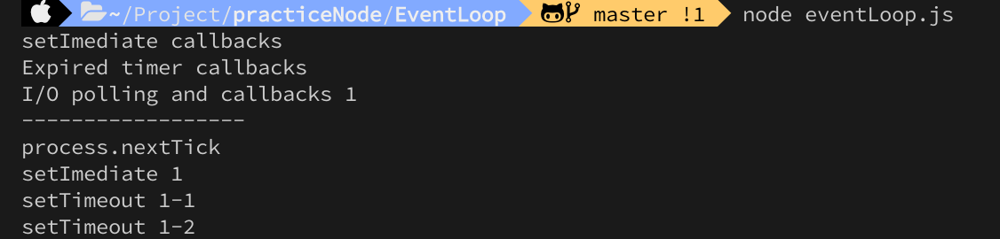

# Practice Nodejs

this is for practicing nodejs by various test.
learn Nodejs runtime Not just by thoery, but by code

# TOC

- [Practice Nodejs](#practice-nodejs)
- [TOC](#toc)
  - [EventLoop](#eventloop)
    - [result1](#result1)
    - [resuslt2](#resuslt2)

## EventLoop


### result1

```javascript
const fs = require('fs');

setTimeout(() => {
  console.log('Expired timer callbacks');
}, 0);
setImmediate(() => {
  console.log('setImediate callbacks');
});
fs.readFile('./test.txt', () => {
  console.log('I/O polling and callbacks');
});
console.log('top-level code');
```


### resuslt2

```javascript
const fs = require('fs');
setTimeout(() => {
  console.log('Expired timer callbacks');
}, 0);
setImmediate(() => {
  console.log('setImediate callbacks');
});
fs.readFile('./test.txt', () => {
  console.log('I/O polling and callbacks');
  console.log('------------------');

  setTimeout(() => {
    console.log('setTimeout 2');
  }, 0);
  setTimeout(() => {
    console.log('setTimeout 3');
  }, 3000);
  setImmediate(() => {
    console.log('setImediate 2');
  });
});
console.log('top-level code');
```



the event loop actually waits for stuff to happen in the poll phase. So in that phase where I/O callbacks are handled. So when thiss queue of callbacks is empt, which is the case in our fictional expample here, so we have no I/O callbacks, all we have is these timers, then the event loop will wait in this phase until there iss an expired timer. But if we sscheduled a callback using setImmediate, then that callback will actually be excuted right away after the polling phase, and even before expired timers, if there is one. And in this case, the imer expires right away, so after zero seconds, but again, the event loop actually waits, so it pauses in the polling phase. And so that seImmediate callback is actually executed first, so that is the whole reason why we have this immediate here after we have the timers.
