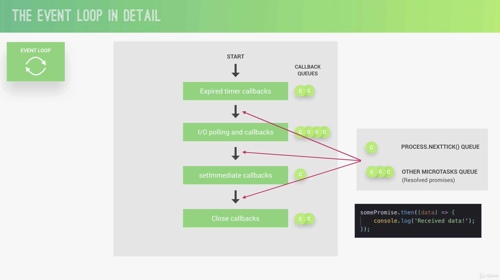
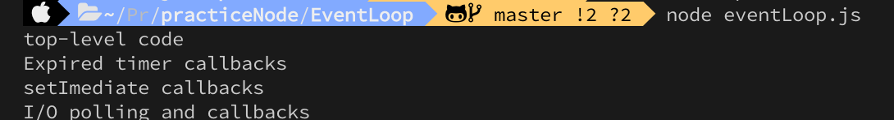

# Practice Nodejs

# TOC

## EventLoop



1. result1

```javascript
const fs = require('fs');

setTimeout(() => {
  console.log('Expired timer callbacks');
}, 0);
setImmediate(() => {
  console.log('setImediate callbacks');
});
fs.readFile('./test.txt', () => {
  console.log('I/O polling and callbacks');
});
console.log('top-level code');
```


