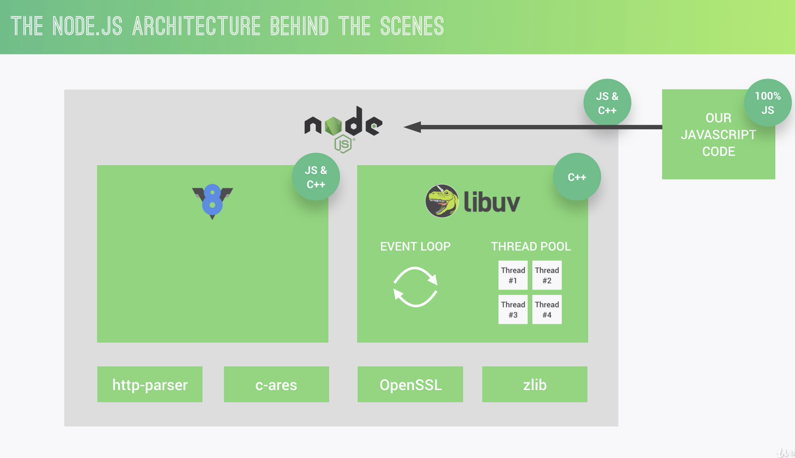
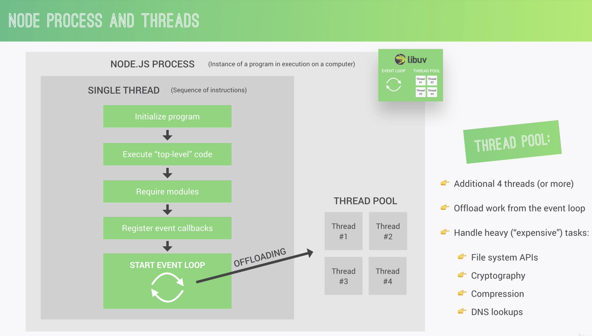
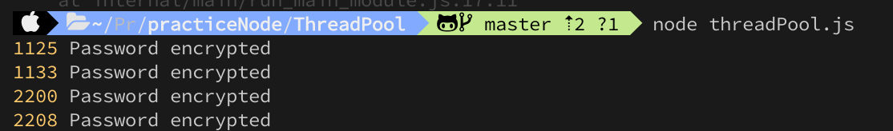

# Nodejs


this is for practicing nodejs by various test.
learn Nodejs runtime Not just by thoery, but by code

# TOC

- [Practice Nodejs](#practice-nodejs)
- [TOC](#toc)
  - [EventLoop](#eventloop)
    - [result1](#result1)
    - [resuslt2](#resuslt2)

## EventLoop


### normal case

```javascript
const fs = require('fs');

setTimeout(() => {
  console.log('Expired timer callbacks');
}, 0);
setImmediate(() => {
  console.log('setImediate callbacks');
});
fs.readFile('./test.txt', () => {
  console.log('I/O polling and callbacks');
});
console.log('top-level code');
```


at this point, the order of these three here doesn't have anything to do with the event loop, because they're actually not running inside the evnet loop just yet.

### the order of eventloop phases

```javascript
const fs = require('fs');
setTimeout(() => {
  console.log('Expired timer callbacks');
}, 0);
setImmediate(() => {
  console.log('setImediate callbacks');
});
fs.readFile('./test.txt', () => {
  console.log('I/O polling and callbacks 1');
  console.log('------------------');

  setTimeout(() => console.log('setTimeout 1-1'), 0);
  setTimeout(() => console.log('setTimeout 1-2'), 3000);
  setImmediate(() => console.log('setImediate 1'));
  process.nextTick(() => console.log('process.nextTick'));
});
```


the event loop actually waits for stuff to happen in the poll phase. So in that phase where I/O callbacks are handled. So when thiss queue of callbacks is empt, which is the case in our fictional expample here, so we have no I/O callbacks, all we have is these timers, then the event loop will wait in this phase until there iss an expired timer. But if we sscheduled a callback using setImmediate, then that callback will actually be excuted right away after the polling phase, and even before expired timers, if there is one. And in this case, the imer expires right away, so after zero seconds, but again, the event loop actually waits, so it pauses in the polling phase. And so that seImmediate callback is actually executed first, so that is the whole reason why we have this immediate here after we have the timers.

And then, process.nextTick(). Remember nextTick is a part of the microtasks queue, which get excuted after each phase, so not just after one entire tick.

## Thread Pool



the thread pool gives us four additional threads that are completely separate from the main single thread. And we can actually configure it up to 128 threads. But usually, these four are enough. So these threads together formed a thread pool. And the event loop can then automatically offload heavy tasks to the thread pool where they don't block our event loop. All this happens automatically behind the scenes by libuv.

### dafault, 4

```javascript
const crypto = require('crypto');
const start = Date.now();

crypto.pbkdf2('password', 'salt', 100000, 1024, 'sha512', () =>
  console.log(Date.now() - start, 'Password encrypted')
);
crypto.pbkdf2('password', 'salt', 100000, 1024, 'sha512', () =>
  console.log(Date.now() - start, 'Password encrypted')
);
crypto.pbkdf2('password', 'salt', 100000, 1024, 'sha512', () =>
  console.log(Date.now() - start, 'Password encrypted')
);
crypto.pbkdf2('password', 'salt', 100000, 1024, 'sha512', () =>
  console.log(Date.now() - start, 'Password encrypted')
);
```


### thread pool size, 2

```javascript
const crypto = require('crypto');
const start = Date.now();
process.env.UV_THREADPOOL_SIZE = 2;

crypto.pbkdf2('password', 'salt', 100000, 1024, 'sha512', () =>
  console.log(Date.now() - start, 'Password encrypted')
);
crypto.pbkdf2('password', 'salt', 100000, 1024, 'sha512', () =>
  console.log(Date.now() - start, 'Password encrypted')
);
crypto.pbkdf2('password', 'salt', 100000, 1024, 'sha512', () =>
  console.log(Date.now() - start, 'Password encrypted')
);
crypto.pbkdf2('password', 'salt', 100000, 1024, 'sha512', () =>
  console.log(Date.now() - start, 'Password encrypted')
);
```


